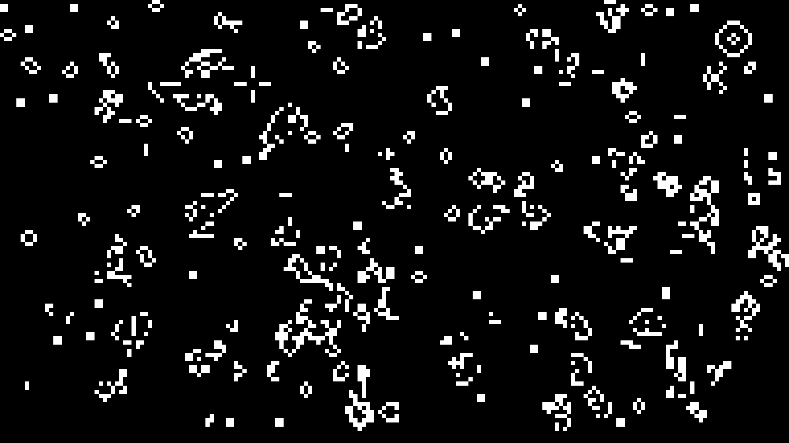

# Conways' Game of Life
## rust-wasm preview
https://eval-exec.github.io/conways-game-of-life/
## run
```bash

git clone https://github.com/eval-exec/conways-game-of-life.git

cd conways-game-of-life

```
### build WebAssembly version of game
```bash
cargo install wasm-pack

python -m http.server
# then open your web browser and visit http://127.0.0.1:8000
```


### build console/2d/3d version of game
```bash
cargo run -p bin -- --mode (2d/3d/console)

```

## result



